# Knowledge-Guided Temporal FNN

本專案以 MIMIC-IV 建立 ICU 動態惡化預測模型，主要 outcome 為未來 6 小時 SOFA 增加至少 2 分，並以 eICU-CRD 進行外部驗證。目前保留 canonical 資料、最新版程式、正式輸出與必要的重現支援資料；探索性與 superseded 結果均在 `outputs/README.md` 分區標示。共用路徑定義於 `project_config.py`。

> 專案入口：先看「研究快照」與「精選實驗圖」，重現分析時依「Code Map」執行，論文數字以 canonical CSV/JSON 為準，不從圖片手動抄錄。

## 快速導覽

- [正式實驗資料規則](#正式實驗資料規則)
- [研究快照](#研究快照)
- [教授建議與投稿宣稱稽核](docs/manuscript_experiment_audit.md)
- [專案結構](#專案結構)
- [Canonical Data](#canonical-data)
- [Code Map](#code-map)
- [正式執行流程](#正式執行流程)
- [Canonical Outputs](#canonical-outputs)
- [精選實驗圖](#精選實驗圖)
- [主文與 Supplementary 配置](#主文與-supplementary-配置)
- [論文寫作底稿](#論文寫作底稿)

**Primary analysis 已鎖定為未來 6 小時 SOFA increase >= 2。** 依 2026-07-14 scope amendment，本研究不再執行 12/24 小時 prediction-horizon experiments；相關 labels 僅保留供未來研究。4/6/12/24 小時仍代表 observation-window sensitivity，不是不同 prediction horizons。完整規則見 `docs/analysis_plan.md`。

**成人 cohort 已鎖定為 ICU 入住時 `age >= 18`。** MIMIC-IV 原始 ICU cohort 最小年齡即為 18 歲，成人條件排除 0 位病人；重建後 `patient_split.csv` 與原檔 byte-identical，因此既有模型 cohort 與結果不變。eICU 原 preprocessing 已套用相同條件。稽核與 Table 1–5、Figure 1–5 見 `docs/adult_cohort_manuscript_artifacts.md`。

## 正式實驗資料規則

- 投稿用正式實驗必須使用完整 eligible cohort；正式 test evaluation 必須包含固定 test split 的所有 eligible windows。
- Equal-sample comparison 僅能使用 `comparison_protocol.json` 與 `equal_sample_windows.csv.gz` 中預先鎖定的 train/validation sampling，不能臨時縮小資料；其 test windows 仍須完整。
- `smoke test`、`max_rows`、`max_stays`、臨時抽樣或少量病人只可檢查 pipeline，結果不得進入主文、Supplement 或正式比較表。
- Explanation 與 consistency analyses 亦須重建全部 prediction-key windows；僅允許分批串流計算，不允許縮小分析 cohort。
- 每次正式執行需保存 cohort/window counts、split hash、完整命令、seed、checkpoint hash 與 `formal_full_data=true` 稽核欄位；總稽核見 `outputs/formal_data_scope_audit_6h/`。

## 研究快照

| 項目 | 狀態 | 正式位置 |
|---|---|---|
| MIMIC leakage-free SOFA labels | 6 h primary 完成；12/24 h secondary labels 已備妥 | `sofa_scores_hourly.csv` |
| MIMIC v3 hourly、missingness 與 time-since features | 完成 | `model_hourly_features_v3.csv` |
| Patient-level split 與 equal-sample protocol | 完成 | `patient_split.csv`, `comparison_protocol.json` |
| Explicit temporal features 與 4/6/12/24 h observation sensitivity | 完成 | `outputs/explicit_temporal_observation_sensitivity_6h/` |
| Explicit-temporal FNN 專屬 Optuna tuning | 完成 | `outputs/explicit_temporal_fnn_tuning_6h/` |
| eICU harmonization、SOFA labels 與 final frozen-checkpoint external validation | 完成；AUROC 0.6221 | `outputs/eicu_external_validation/final_frozen_model_evaluation/` |
| 新版 FNN full-cohort 6 h training | 完成；test AUROC 0.6559 | `outputs/explicit_temporal_fnn_formal_6h/seed_42/` |
| Frozen final-model 6 h test evaluation | 完成；1,000 次 patient-clustered bootstrap | `outputs/final_test_evaluation_6h/` |
| 正式 6 h FNN 消融，4 variants x 3 seeds | 完成 | `outputs/fnn_ablation_6h_equal_sample/` |
| Frozen-model temporal fuzzy rule extraction | 完成；24 條 supported rules | `outputs/temporal_rule_extraction_6h/` |
| Rule Evaluation Framework 與 TP/FP/FN timelines | 完成；5 seeds | `outputs/rule_evaluation_6h/` |
| 成人 eligibility audit、cohort flow、Table 1–5、Figure 1–5 | 完成 | `outputs/manuscript_tables_figures_6h/` |
| 新版 equal-sample explicit KG-TFNN paired comparison | 完成；1,000 次 patient-clustered paired bootstrap | `outputs/explicit_kg_tfnn_paired_comparison_6h/` |
| SOFA outcome sensitivity 與 event-level alarm burden | 完成；500 次 clustered bootstrap | `outputs/clinical_sensitivity_analyses_6h/` |
| Age/sex/ethnicity/ICU type/current SOFA subgroup | 完成 | `outputs/clinical_sensitivity_analyses_6h/` |
| eICU hospital-clustered sensitivity | 完成；205 hospitals、500 次 hospital bootstrap | `outputs/eicu_hospital_sensitivity_6h/` |
| Missingness-only / no-missingness ablation | 完成；3-seed ensemble + 1,000 patient-cluster bootstrap | `outputs/missingness_ablation_6h_equal_sample/evaluation/` |
| Feature-matched GRU / XGBoost / LightGBM | 完成；相同 39 hourly channels、相同 test windows | `outputs/feature_matched_baselines_6h_equal_sample/` |
| Raw rule firing 與 activation-threshold sensitivity | 完成；0.01–0.50、current/attention-selected hour | `outputs/raw_rule_firing_6h/` |
| Cohort denominator、SOFA harmonization、raw/calibrated reporting | 完成 | `outputs/expanded_experiment_reporting_6h/` |
| LightGBM/XGBoost + TreeSHAP、EBM 與 KG-TFNN explanation benchmark | 正式全量完成；830,839 MIMIC + 6,215,890 eICU windows | `outputs/posthoc_explainability_comparison_6h/` |
| 跨模型統一 explanation complexity | 完成；13 個共同 clinical variables、80% attribution mass | `outputs/posthoc_explainability_comparison_6h/unified_explanation_complexity_report.md` |
| Frozen eICU equal-sample model comparison | 完成；5 models、6,215,890 windows、200 次 patient bootstrap | `outputs/eicu_frozen_baseline_validation_6h/` |
| Clinical-consistency regularization behavior audit | 正式全量完成；3 seeds x 2 variants x 830,839 windows | `outputs/clinical_consistency_regularization_6h/` |
| SOFA documentation-bias sensitivity 與器官貢獻 | 完成；common-component labels、complete-case、missing-as-normal | `outputs/sofa_documentation_bias_6h/` |
| Missingness Discussion 四種機制 | 完成；workflow、physician attention、disease severity、monitoring frequency 均已納入並限制 causal 解讀 | `paper/TSP_template.tex`, `docs/manuscript_experiment_audit.md` |
| Supplementary Tables S1--S13 / Figures S1--S7 | 完成；S10--S11/S6--S7 已重建為正式全量結果 | `outputs/supplementary_material/`, `paper/Supplementary_Material.pdf` |
| 投稿底稿實驗、數學與一致性審查 | 完成；full-data XAI/consistency、39-channel input、bootstrap 定義與限制均已對齊；原稿有可驗證備份 | `paper/TSP_template.tex`, `paper/backups/20260714_151000_before_consistency_alignment/` |
| TRIPOD+AI 與 PROBAST+AI project checklist | 完成；投稿頁碼待最終排版 | `docs/TRIPOD_AI_checklist.md`, `docs/PROBAST_AI_checklist.md` |
| Reproducibility manifest | 完成；環境、關鍵實驗檔案與主文/Supplement TeX SHA-256 | `outputs/reproducibility_6h/analysis_manifest.json` |
| Formal data-scope audit | 完成；116 checks passed、0 failed | `outputs/formal_data_scope_audit_6h/formal_data_scope_audit.md` |

## 專案結構

```text
D:\醫資
|-- *.py                         # 可重現分析程式；維持根目錄以保留既有 imports
|-- dataset/                     # MIMIC-IV / eICU 原始資料，不進 Git
|-- docs/                        # analysis plan、方法、實驗與 checklist
|-- outputs/                     # checkpoints、metrics、tables、figures、audit configs
|-- paper/                       # TSP 主文、Supplement、bibliography 與備份
|-- model_hourly_features_v3.csv # MIMIC canonical hourly model table
|-- sofa_scores_hourly.csv       # MIMIC canonical hourly SOFA/outcomes
|-- patient_split.csv            # frozen patient-level split
`-- README.md                    # 本專案唯一總入口
```

核心程式暫不搬入子資料夾：訓練腳本、checkpoint config 與論文圖表均使用目前相對路徑，移動會降低既有實驗的可重現性。`__pycache__/`、LaTeX auxiliary files 與單次暫存檔不是研究產物。

## Canonical Data

| 資料 | 約略大小 | 用途與狀態 |
|---|---:|---|
| `dataset/MIMIC-IV/` | raw | MIMIC-IV 原始資料；只讀、不進 Git |
| `dataset/e-ICU/` | raw | eICU-CRD 原始資料；只讀、不進 Git |
| `model_hourly_features_v3.csv` | 17.39 GiB | MIMIC 完整 hourly predictors、missingness 與 temporal channels |
| `sofa_scores_hourly.csv` | 1.86 GiB | MIMIC hourly SOFA components 與 6/12/24 h labels |
| `outputs/eicu_external_validation/eicu_hourly_features.pkl` | 3.51 GiB | eICU harmonized hourly model table |
| `patient_split.csv` | 4.0 MiB | Frozen `subject_id` train/validation/test split |
| `comparison_protocol.json` | 7.5 KiB | Fair-comparison cohort、欄位與 fingerprint |
| `equal_sample_windows.csv.gz` | 4.8 MiB | Prespecified equal-sample train/validation windows；test 保持完整 |
| `model_hourly_features_v3_feature_manifest.json` | 2.1 KiB | Feature schema 與來源 manifest |
| `model_hourly_features_v3_quality.json` | 2.9 KiB | Hourly feature quality audit |
| `sofa_scores_hourly_quality.json` | 0.6 KiB | SOFA label quality audit |

大型資料皆由 `.gitignore` 排除；重現性依賴 manifest、split/protocol hash、checkpoint hash 與產生程式，不依賴把 raw EHR 上傳至版本庫。

## Code Map

### Data And Labels

| 工作 | Canonical code | 主要輸出 |
|---|---|---|
| MIMIC SOFA 與 leakage-free outcome | `sofa_score.py`, `sofa_label_utils.py` | `sofa_scores_hourly.csv` |
| MIMIC hourly/temporal preprocessing | `preprocessing.py`, `temporal_feature_utils.py`, `clinical_data_quality.py` | `model_hourly_features_v3.csv` |
| Patient split 與 comparison protocol | `patient_split.py`, `comparison_protocol.py` | `patient_split.csv`, `comparison_protocol.json`, `equal_sample_windows.csv.gz` |
| 共用路徑與資料設定 | `project_config.py` | MIMIC/eICU canonical path definitions |
| NEWS2 與 clinical-score baselines | `news2_score.py`, `clinical_score_baselines.py` | Clinical comparator predictions |
| eICU audit、harmonization 與 SOFA | `eicu_data_audit.py`, `eicu_preprocessing.py` | `outputs/eicu_external_validation/eicu_hourly_features.pkl` |

### Models And Training

| 工作 | Canonical code | 主要輸出 |
|---|---|---|
| KG-TFNN architecture/loss | `anfis_model.py` | Model classes、membership/rule definitions |
| Optuna tuning | `tune_fnn_optuna.py` | `outputs/explicit_temporal_fnn_tuning_6h/` |
| Formal full-cohort training | `train_fnn.py` | `outputs/explicit_temporal_fnn_formal_6h/seed_42/best_model.pt` |
| Interpretable baselines | `interpretable_baselines.py` | LR、Decision Tree、GAM、EBM |
| Black-box/feature-matched baselines | `blackbox_baselines.py` | RF、XGBoost、LightGBM、LSTM、GRU |
| FNN/missingness ablations | `ablation_fnn_experiments.py`, `summarize_missingness_ablation.py` | Formal three-seed ablation outputs |

### Evaluation And Interpretation

| 工作 | Canonical code | 主要輸出 |
|---|---|---|
| Frozen one-time test evaluation | `final_test_evaluation.py` | `outputs/final_test_evaluation_6h/` |
| Unified metrics、CI、paired tests | `model_evaluation_report.py`, `advanced_model_evaluation.py` | AUROC/AUPRC/Brier/ECE/DCA/clustered CI |
| Equal-sample orchestration | `run_fair_comparison.py`, `prepare_explicit_paired_comparison.py` | Matched model predictions/comparisons |
| Observation-window sensitivity | `run_observation_window_sensitivity.py` | 4/6/12/24 h observation analyses |
| Clinical utility/subgroups | `clinical_sensitivity_analyses.py`, `eicu_hospital_sensitivity.py` | Alarm burden、lead time、subgroups、site heterogeneity |
| Rule extraction/evaluation | `extract_temporal_fuzzy_rules.py`, `rule_evaluation_framework.py`, `raw_rule_firing_analysis.py`, `patient_case_rule_analysis.py` | Rules、stability、drift、activation、case timelines |
| SOFA documentation sensitivity | `sofa_documentation_bias_analysis.py` | Common-component outcomes、organ contributions |
| Full-data XAI/consistency | `posthoc_explainability_comparison.py`, `clinical_consistency_regularization_analysis.py`, `full_data_window_utils.py` | 全部 MIMIC/eICU prediction windows 與 formal cohort audit |
| eICU frozen validation | `eicu_external_validation.py` | External predictions、metrics、calibration |
| eICU frozen comparator transport | `eicu_frozen_baseline_validation.py` | Equal-sample KG-TFNN/LightGBM/XGBoost/GRU/EBM external metrics、paired CI、freeze audit |

### Manuscript And Reproducibility

| 工作 | Canonical code/file | 主要輸出 |
|---|---|---|
| Cohort、Table 1–5 與 manuscript base figures | `cohort_tables_figures.py`, `paper_figures.py` | `outputs/manuscript_tables_figures_6h/` |
| Supplementary Tables S1–S13/Figures S1–S7 | `build_supplementary_material.py` | `paper/Supplementary_Material.tex/.pdf` |
| Reporting audit | `expanded_experiment_reporting.py` | `outputs/expanded_experiment_reporting_6h/` |
| Reproducibility manifest | `reproducibility_manifest.py` | `outputs/reproducibility_6h/analysis_manifest.json` |
| Main manuscript | `paper/TSP_template.tex` | `paper/TSP_template.pdf` |

## 正式執行流程

所有命令由專案根目錄執行：

```powershell
# 1. Leakage-free SOFA 與 outcomes；成人定義固定為 age >= 18
.\env\Scripts\python.exe sofa_score.py --min-age 18

# 2. v3 hourly 與 explicit temporal input channels
.\env\Scripts\python.exe preprocessing.py --min-age 18

# 3. 固定 patient split 與公平比較 cohort
.\env\Scripts\python.exe patient_split.py --min-age 18
.\env\Scripts\python.exe comparison_protocol.py

# 4. 重新執行 explicit-temporal tuning 時使用
.\env\Scripts\python.exe tune_fnn_optuna.py --explicit-temporal-features --comparison-mode equal_sample --n-trials 30 --trial-epochs 8 --study-name explicit_temporal_fnn_6h_v1 --device cuda --output-dir outputs\explicit_temporal_fnn_tuning_6h

# 5. 以最佳 validation 參數進行 full-cohort training
& .\outputs\explicit_temporal_fnn_tuning_6h\train_with_best_params.ps1

# 6. Frozen final test evaluation（已完成並鎖定，不可重跑挑選結果）
.\env\Scripts\python.exe final_test_evaluation.py --bootstrap-reps 1000 --device cuda

# 7. Observation-window sensitivity
.\env\Scripts\python.exe run_observation_window_sensitivity.py

# 8. Baselines 與統一評估
.\env\Scripts\python.exe run_fair_comparison.py --mode equal_sample --horizons 6
.\env\Scripts\python.exe advanced_model_evaluation.py

# 9. Full-data explanation 與 consistency analyses（無抽樣參數）
.\env\Scripts\python.exe posthoc_explainability_comparison.py --device cuda
.\env\Scripts\python.exe posthoc_explainability_comparison.py --complexity-only
.\env\Scripts\python.exe clinical_consistency_regularization_analysis.py --device cuda

# 10. 驗證所有 canonical experiments 的資料範圍
.\env\Scripts\python.exe formal_data_scope_audit.py
```

所有模型必須使用相同 `subject_id` split、test windows、predictors 與 outcome。Checkpoint、threshold、calibration 與 hyperparameters 只能由 train/validation 決定；test 僅能在模型定案後使用一次。

## eICU 外部驗證

```powershell
.\env\Scripts\python.exe eicu_data_audit.py
.\env\Scripts\python.exe eicu_preprocessing.py --write-csv
.\env\Scripts\python.exe eicu_external_validation.py --bootstrap-reps 500 --output-dir outputs\eicu_external_validation\final_frozen_model_evaluation
.\env\Scripts\python.exe eicu_frozen_baseline_validation.py --bootstrap-reps 200 --device cuda
```

Final external test 包含 80,239 位病人、99,262 次 ICU stay、6,215,890 個視窗與 205 家醫院。Frozen final checkpoint 的 AUROC 為 0.6221（patient-clustered 95% CI 0.6192–0.6249），AUPRC 為 0.0922（0.0902–0.0942）；沒有使用 eICU outcome fitting 或 recalibration。

Hospital-clustered sensitivity 的 AUROC 95% CI 為 0.6127–0.6326，AUPRC 95% CI 為 0.0864–0.0978。共有 142 家醫院符合 per-site reporting threshold；其 AUROC 中位數為 0.6216，IQR 0.5915–0.6524，顯示跨院異質性不可忽略。

Equal-sample frozen transport 使用相同 6,215,890 個 eICU windows。AUROC/AUPRC 分別為 KG-TFNN 0.6100/0.0862、LightGBM 0.6247/0.0949、XGBoost 0.6323/0.0999、GRU 0.6036/0.0721、current-state EBM 0.5869/0.0695。校正與 fixed-specificity thresholds 全部源自 MIMIC validation；eICU 不參與 fitting。這組結果用於比較 transportability，不與 full-cohort KG-TFNN 混作 architecture-superiority inference。

## Canonical Outputs

### Formal Results

| 分析 | Canonical report/data | 圖片目錄 |
|---|---|---|
| Full-cohort FNN training | `docs/full_cohort_training_6h.md` | `outputs/explicit_temporal_fnn_formal_6h/seed_42/figures/` |
| Frozen internal test | `outputs/final_test_evaluation_6h/final_test_report.md` | `outputs/final_test_evaluation_6h/advanced/figures/` |
| Equal-sample paired comparison | `outputs/explicit_kg_tfnn_paired_comparison_6h/evaluation/advanced_metrics.csv` | `outputs/explicit_kg_tfnn_paired_comparison_6h/evaluation/figures/` |
| Feature-matched GRU/trees | `outputs/feature_matched_baselines_6h_equal_sample/` | `outputs/feature_matched_baselines_6h_equal_sample/figures/` |
| Formal FNN ablation | `outputs/fnn_ablation_6h_equal_sample/ablation_aggregate.csv` | `outputs/fnn_ablation_6h_equal_sample/figures/` |
| Missingness ablation | `outputs/missingness_ablation_6h_equal_sample/evaluation/missingness_ablation_report.md` | `outputs/missingness_ablation_6h_equal_sample/evaluation/figures/` |
| Observation sensitivity | `docs/explicit_temporal_observation_sensitivity.md` | `outputs/explicit_temporal_observation_sensitivity_6h/figures/` |
| SOFA/outcome/clinical utility | `outputs/clinical_sensitivity_analyses_6h/clinical_sensitivity_report.md` | `outputs/clinical_sensitivity_analyses_6h/figures/` |
| SOFA documentation audit | `outputs/sofa_documentation_bias_6h/sofa_documentation_bias_report.md` | `outputs/sofa_documentation_bias_6h/figures/` |
| Rule Evaluation Framework | `outputs/rule_evaluation_6h/rule_evaluation_report.md` | `outputs/rule_evaluation_6h/figures/` |
| Frozen eICU validation | `outputs/eicu_external_validation/final_frozen_model_evaluation/eicu_external_validation_report.md` | `outputs/eicu_external_validation/final_frozen_model_evaluation/figures/` |
| Frozen eICU comparator transport | `outputs/eicu_frozen_baseline_validation_6h/eicu_frozen_baseline_validation_report.md` | `outputs/eicu_frozen_baseline_validation_6h/figures/` |
| eICU site heterogeneity | `outputs/eicu_hospital_sensitivity_6h/eicu_hospital_sensitivity_report.md` | `outputs/eicu_hospital_sensitivity_6h/figures/` |
| Full-data explanation benchmark | `outputs/posthoc_explainability_comparison_6h/explanation_quality_report.md` | `outputs/posthoc_explainability_comparison_6h/figures/` |
| Unified explanation complexity | `outputs/posthoc_explainability_comparison_6h/unified_explanation_complexity_report.md` | `outputs/posthoc_explainability_comparison_6h/figures/` |
| Full-data consistency behavior | `outputs/clinical_consistency_regularization_6h/clinical_consistency_report.md` | `outputs/clinical_consistency_regularization_6h/figures/` |
| Formal data-scope audit | `outputs/formal_data_scope_audit_6h/formal_data_scope_audit.md` | Machine-readable JSON in the same directory |

### Data-Scope Classification

| 分析 | 實際資料範圍 | 正確定位 |
|---|---|---|
| Primary KG-TFNN | 3,843,400 train、819,573 validation、830,839 test windows | Full-cohort primary estimate |
| Equal-sample comparisons/ablations | Prespecified 200,000 train、50,000 validation、完整 830,839 test windows | Fairness/sensitivity estimate，不是 full-cohort training estimate |
| Explanation benchmark | 完整 830,839 MIMIC 與 6,215,890 eICU windows | Full-data structural explanation analysis；不是 clinician reader study |
| Frozen eICU comparator transport | Prespecified 200,000 train、50,000 validation、完整 6,215,890 external windows | Source-only calibration；不是 full-cohort architecture comparison |
| Consistency behavioral stress test | 每個 seed/variant 完整 830,839 MIMIC windows | Full-test-cohort directional stress test |

目前沒有 sampled/smoke output 被登錄為 canonical evidence。完整自動稽核為 `116 passed / 0 failed`；equal-sample 與 full-cohort estimates 仍須分開報告。

### Documents

- 文件總覽：`docs/README.md`
- Analysis plan：`docs/analysis_plan.md`
- 實驗狀態：`docs/experiment_status.md`
- Manuscript audit：`docs/manuscript_experiment_audit.md`
- TRIPOD+AI：`docs/TRIPOD_AI_checklist.md`
- PROBAST+AI：`docs/PROBAST_AI_checklist.md`
- Supplementary Tables S1–S13 / Figures S1–S7：`outputs/supplementary_material/supplementary_material.md`
- Output 子目錄索引：`outputs/README.md`

## 精選實驗圖

下列 PNG 用於 README 預覽；投稿與排版應使用同目錄 PDF。圖片只呈現結果，正式數值仍以 CSV/JSON 與 clustered confidence intervals 為準。

### Cohort And Architecture

| Cohort selection | KG-TFNN architecture |
|:---:|:---:|
| 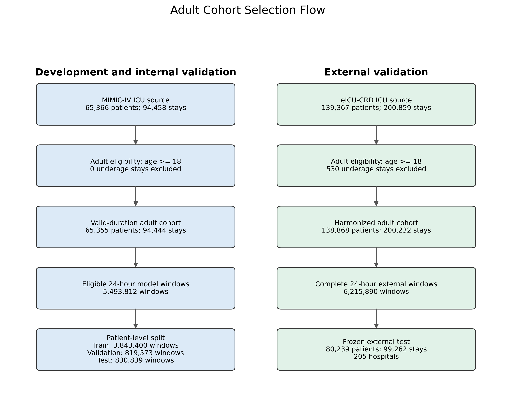 | 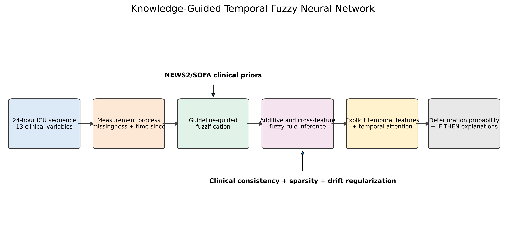 |

### Predictive Performance And Ablation

| Feature-matched baseline comparison | FNN component ablation |
|:---:|:---:|
| 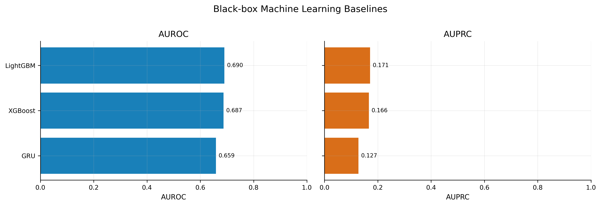 | 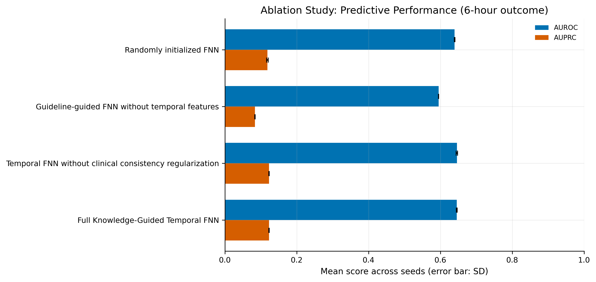 |

LightGBM/XGBoost 的 discrimination 高於 KG-TFNN，因此目前論文定位是 prediction–interpretability trade-off，不是 architecture superiority。消融則顯示 temporal design 是主要 performance contribution；consistency regularization 不應被描述為 accuracy booster。

### Calibration And Clinical Utility

| Internal/external calibration | Decision curve analysis |
|:---:|:---:|
| 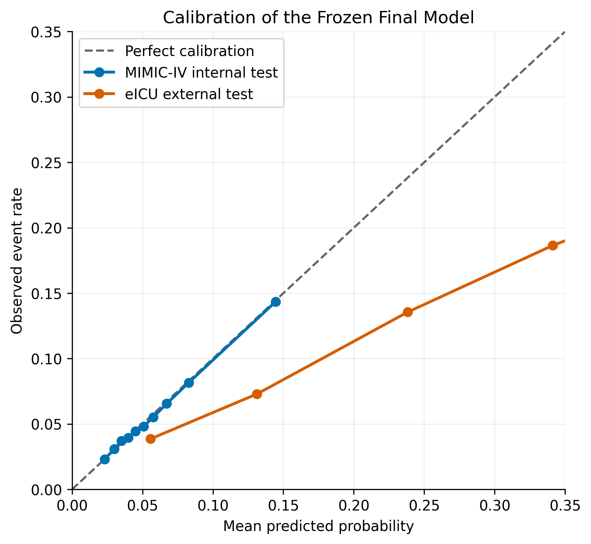 | 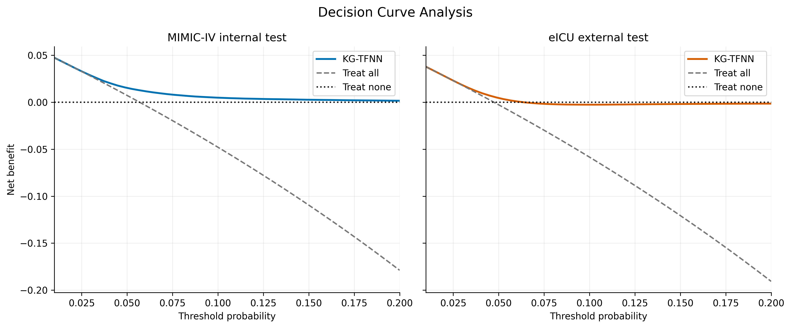 |

eICU calibration 與 transported fixed-specificity operating points 均有衰退；DCA 未預先指定 intervention/cost ratio，因此只能作為 exploratory clinical-utility analysis。

### Knowledge And Outcome Validity

| Membership functions before/after training | SOFA documentation sensitivity |
|:---:|:---:|
| 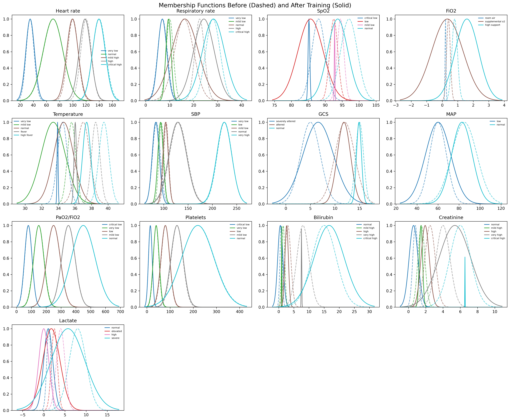 | 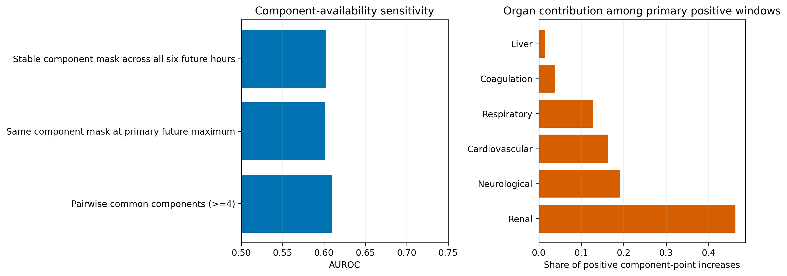 |

Membership 圖直接呈現 guideline initialization 如何進入模型以及訓練後漂移；SOFA common-component analysis 顯示 primary label 仍受 documentation availability 影響，不能稱為完全無 documentation bias 的 ground truth。

### External Generalizability And Cases

| eICU hospital heterogeneity | TP/FP/FN timelines and activated rules |
|:---:|:---:|
| 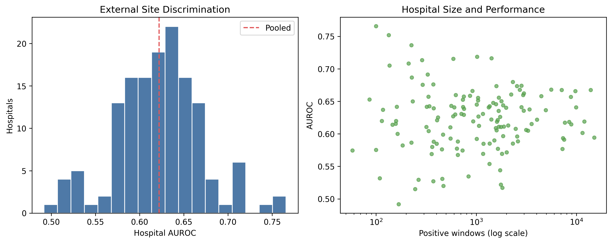 | 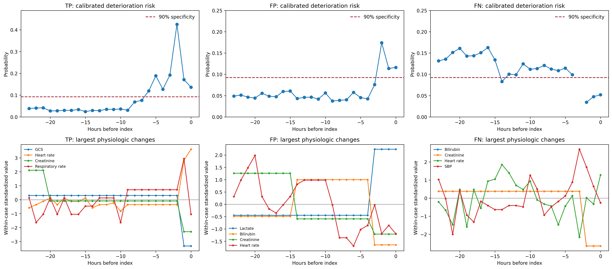 |

Site-level estimates與個案圖均為描述性分析；它們不能取代 prospective workflow evaluation、clinician reader study 或正式 fairness inference。

### External Baselines And Explanation Complexity

| Frozen eICU model comparison | Unified explanation complexity |
|:---:|:---:|
| 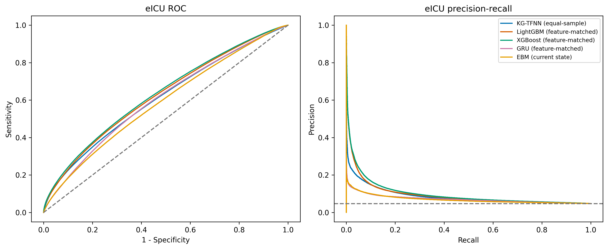 | 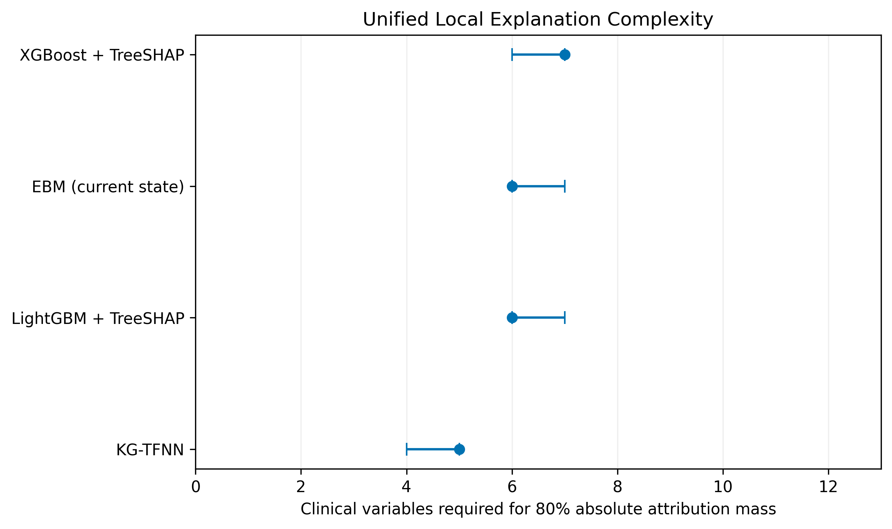 |

KG-TFNN 的共同 complexity 指標較低，但 XGBoost 與 LightGBM 的 eICU discrimination 較高；這支持 prediction–intrinsic-inspectability trade-off。兩項結果已整合至主文 Table 2 Panel A2、Figure 4、Table 3 Panel B，以及 Abstract、Discussion 與 Conclusion；full-cohort 與 equal-sample estimates 仍分開標示。

## 主文與 Supplementary 配置

經確認後，membership functions、SOFA documentation sensitivity、frozen eICU baseline transport 與 unified explanation complexity 已放入主文；其餘 secondary/exploratory analyses 保留在 Supplement。

| 位置 | 內容 | 論文邏輯 |
|---|---|---|
| Main Figure 3 | Membership functions before/after training | 直接呈現 knowledge initialization 與 learned drift，支撐 KG-TFNN 核心 novelty |
| Main Figure 6 | SOFA documentation-availability sensitivity | Outcome validity 是主分析可信度的一部分，應靠近 outcome sensitivity 結果 |
| Supplementary Figure S1 | Raw firing threshold sensitivity | 支援 activation threshold 的 robustness，不占主文篇幅 |
| Supplementary Figures S2–S3 | MIMIC subgroup 與 eICU hospital heterogeneity | Secondary robustness/site analyses |
| Supplementary Figures S4–S5 | Case timelines 與 patient-specific raw firing | 補充 Main Figure 7，不重複主文摘要 |
| Supplementary Figure S6 / Table S10 | TreeSHAP/EBM/KG-TFNN explanation comparison | 全量 structural benchmark；EBM 仍是 current-state comparator，且未做 clinician reader validation |
| Supplementary Figure S7 / Table S11 | Consistency behavior | 每組完整 test cohort；效果主要限於 cross-seed stability，不宣稱全面改善 |
| Supplementary Tables S1–S2 | SOFA reconstruction、NEWS2-to-fuzzy mapping | 技術細節必要但篇幅大，Supplement 最利於 outcome/model 重建 |

## 環境

```powershell
.\env\Scripts\python.exe -m pip install -r requirements.txt
```

## 論文寫作底稿

以下內容固定本研究目前正式版本的資料來源、cohort、predictors、outcome、實驗與主要結果。撰寫論文時應以此區與正式 CSV/JSON 為準，不要從圖檔手動抄數字。

### 1. 研究設計

- 研究類型：多中心 ICU retrospective cohort study。
- Development database：MIMIC-IV。
- External validation database：eICU-CRD。
- Primary outcome：目前時間點起未來 6 小時內，SOFA 相對目前增加至少 2 分。
- Prediction horizon：只報告未來 6 小時 SOFA increase >= 2；12/24 小時 labels 保留但不執行正式 outcome experiments。
- Primary observation window：過去 24 小時逐小時序列。
- Sensitivity observation windows：4、6、12、24 小時。
- 成人定義：ICU 入住時 `age >= 18`。
- 分析單位：每個 eligible ICU stay-hour prediction window；信賴區間以 `subject_id` clustered bootstrap 計算。

### 2. 資料庫數量總覽

| 統計單位 | MIMIC-IV development/internal | eICU-CRD external |
|---|---:|---:|
| 實際使用 raw tables | 7 | 8 |
| 實際讀取 raw rows | 608,690,476 | 399,686,522 |
| ICU source patients | 65,366 | 139,367 |
| ICU source stays | 94,458 | 200,859 |
| Adult valid-time patients | 65,355 | 138,868 |
| Adult valid-time stays | 94,444 | 200,232 |
| Harmonized hourly states | 8,275,274 | 12,994,585 |
| Valid 6 h SOFA labels | 6,938,122 | 7,821,053 |
| 24 h history prediction windows | 5,493,812 | 6,215,890 |
| Final evaluation patients | 7,287 internal-test patients | 80,239 external-test patients |
| Final evaluation stays | 9,894 internal-test stays | 99,262 external-test stays |
| Hospitals represented in final evaluation | 1 | 205 |

Raw rows、hourly states、valid labels 與 prediction windows 是不同分析層級，論文中不可把它們統稱為「樣本數」。模型效能的正式 N 應使用 prediction windows，cohort characteristics 則使用 patients 或 ICU stays。

### 3. MIMIC-IV 實際使用資料

MIMIC-IV 原始資料中，只有下列 7 張表進入 cohort、predictor 或 SOFA 建構。Raw rows 是本機 `.csv.gz` 實際資料列數，不含 header。

| 原始表 | Raw rows | 本研究用途 | 主要抽取內容 |
|---|---:|---|---|
| `patients.csv.gz` | 364,627 | 成人條件與 Table 1 | `anchor_age`、`anchor_year`、gender |
| `admissions.csv.gz` | 546,028 | Table 1 | race |
| `icustays.csv.gz` | 94,458 | ICU cohort 與逐小時時間軸 | `subject_id`、`hadm_id`、`stay_id`、`intime`、`outtime` |
| `chartevents.csv.gz` | 432,997,491 | 生理 predictors 與 SOFA | heart rate、respiratory rate、SpO2、BP、temperature、FiO2、GCS、ventilation |
| `labevents.csv.gz` | 158,374,764 | laboratory predictors 與 SOFA | lactate、PaO2、bilirubin、creatinine、platelets |
| `inputevents.csv.gz` | 10,953,713 | cardiovascular SOFA | dopamine、dobutamine、epinephrine、norepinephrine |
| `outputevents.csv.gz` | 5,359,395 | renal SOFA | urine output |
| **合計** | **608,690,476** |  |  |

`diagnoses_icd.csv.gz`、`d_icd_diagnoses.csv.gz` 與 `d_items.csv.gz` 沒有進入目前模型。診斷碼、年齡、性別與 race/ethnicity 都不是 13 個模型 predictors；人口學資料只用於 eligibility、Table 1 與後續 subgroup analysis。

### 4. MIMIC-IV cohort 數量

| 階段 | Patients | ICU stays / windows | 說明 |
|---|---:|---:|---|
| MIMIC ICU source | 65,366 | 94,458 stays | `icustays.csv.gz` 中的 unique subjects |
| 成人條件排除後 | 65,366 | 94,458 stays | 最小年齡已為 18；未成年排除數為 0 |
| 有效 ICU 時間軸 | 65,355 | 94,444 stays | 排除 14 個缺失或無效 ICU time stays |
| Hourly feature/SOFA table | 65,355 | 8,275,274 stay-hours | `model_hourly_features_v3.csv` |
| 有效 6 h SOFA labels | - | 6,938,122 stay-hours | Event prevalence 6.46% |
| 24 h history eligible model cohort | - | 5,493,812 windows | Train、validation、test 合計 |
| Train analytic cohort | 34,185 | 46,214 stays；3,843,400 windows | 217,650 positives；5.66% |
| Validation analytic cohort | 7,301 | 9,870 stays；819,573 windows | 47,638 positives；5.81% |
| Internal test analytic cohort | 7,287 | 9,894 stays；830,839 windows | 47,292 positives；5.69% |
| Final-model test evaluation | 7,287 | 830,839 windows | 僅計算具有完整 eligible windows 的 test patients |

`patient_split.csv` 本身包含 45,757/9,807/9,802 位 train/validation/test subjects；Table 1 的 train 為 45,746 位，是因為另排除沒有有效 ICU 時間軸的 subjects。Adult-filtered split 重建與原 manifest byte-identical，assignment 差異為 0。

### 5. eICU-CRD 實際使用資料

eICU 只使用下列 8 張表進行 feature harmonization 與 SOFA label construction。

| 原始表 | Raw rows | 本研究用途 | Relevant/eligible rows 或主要訊號 |
|---|---:|---|---|
| `patient.csv.gz` | 200,859 | patient/stay/hospital cohort | age、gender、ethnicity、hospital、ICU offset |
| `vitalPeriodic.csv.gz` | 146,671,642 | periodic vital signs | 145,736,206 eligible rows |
| `vitalAperiodic.csv.gz` | 25,075,074 | aperiodic vital signs | 24,935,625 eligible rows |
| `lab.csv.gz` | 39,132,531 | laboratory predictors 與 SOFA | 1,901,407 relevant rows |
| `nurseCharting.csv.gz` | 151,604,232 | GCS 與 nursing vital signs | 52,204,521 relevant rows |
| `respiratoryCharting.csv.gz` | 20,168,176 | FiO2 與 respiratory support | 4,572,294 relevant rows |
| `infusionDrug.csv.gz` | 4,803,719 | cardiovascular SOFA | 776,364 pressor rows；104,395 可換算 positive rows |
| `intakeOutput.csv.gz` | 12,030,289 | renal SOFA | 2,970,314 urinary rows |
| **合計** | **399,686,522** |  |  |

升壓劑只保留可換算為 mcg/kg/min 的紀錄；尿量只使用 urinary output，排除 drain、chest-tube 與 `outputtotal`。所有時間以 ICU admission-relative offset 對齊，不使用未來量測補值。

### 6. eICU-CRD cohort 數量

| 階段 | Patients | ICU stays / windows | Hospitals | 說明 |
|---|---:|---:|---:|---|
| eICU source | 139,367 | 200,859 stays | 208 | `patient.csv.gz` |
| 成人且有效 duration | 138,868 | 200,232 stays | 208 | 排除 95 個缺失年齡 stays、530 個未成年 stays、2 個無效 duration stays |
| Harmonized hourly table | 138,868 | 12,994,585 stay-hours | 208 | MIMIC-compatible schema |
| 有效 6 h SOFA labels | - | 7,821,053 stay-hours | - | 421,089 positives；5.38% |
| Frozen external test | 80,239 | 6,215,890 windows；99,262 stays | 205 | 294,949 positives；4.75% |

eICU 不參與 hyperparameter tuning、checkpoint selection、probability recalibration 或 threshold selection。MIMIC 訓練完成的 checkpoint、Platt calibration 與 operating thresholds 原封不動套用至 eICU。

### 7. 最終 13 個模型 predictors

| Predictor | MIMIC-IV source | eICU source | Hourly aggregation/derivation |
|---|---|---|---|
| Heart rate | `chartevents` | `vitalPeriodic`、`nurseCharting` | mean |
| Respiratory rate | `chartevents` | `vitalPeriodic`、`nurseCharting` | mean |
| SpO2 | `chartevents` | `vitalPeriodic`、`nurseCharting` | minimum |
| FiO2 | `chartevents` | `respiratoryCharting` | maximum；統一為 0.21–1.00 |
| Temperature | `chartevents` | periodic/aperiodic/nursing | mean；Fahrenheit 轉 Celsius |
| Systolic BP | `chartevents` | periodic/aperiodic | arterial 優先，否則 non-invasive；minimum |
| GCS total | `chartevents` | `nurseCharting` | eye + verbal + motor；worst value |
| MAP | `chartevents` | periodic/aperiodic | arterial 優先，否則 non-invasive；minimum |
| PaO2/FiO2 | `labevents` + FiO2 | `lab` + respiratory | 同一小時 PaO2 / FiO2 |
| Platelets | `labevents` | `lab` | minimum |
| Bilirubin | `labevents` | `lab` | maximum |
| Creatinine | `labevents` | `lab` | maximum |
| Lactate | `labevents` | `lab` | maximum |

機械通氣、PaO2、升壓劑與尿量另外用於 SOFA component 計算，但不是最終 13 個 predictors。

### 8. Preprocessing 與 temporal features

1. 以每個 ICU `intime` 或 admission-relative offset 建立逐小時 grid。
2. 先套用臨床合理範圍；異常格式或不合理數值轉為 missing，不做 outcome-aware clipping。
3. 同一小時多筆紀錄依臨床 worst direction 或 mean 聚合。
4. 在任何補值前建立 `is_missing` 與 `time_since_last_measurement`。
5. 只在同一 `stay_id` 內 forward-fill；不 backward-fill，也不跨 stay 補值。
6. 建立 current、mean、min、max、standard deviation、short-term change、window change、slope、abnormal duration 與 abnormal measurement frequency。
7. Temporal descriptors 分別以 4/6/12/24 h 建立；primary model 使用完整 24 h sequence。
8. 訓練資料缺失值最後使用固定 clinical defaults；defaults 與 scaling 只依既定規則或 train data 決定。

Table 2 的 missingness 是 LOCF 前的 current-hour raw missingness，不是 forward-fill 後仍為空值的比例。

### 9. Outcome construction

- SOFA 依過去 24 小時 worst values 計算 respiration、coagulation、liver、cardiovascular、CNS 與 renal 六個 components。
- Primary SOFA 至少需要 4 個可觀測 components；另保留 assume-normal 與 complete-case sensitivity scores。
- 每個 index hour 的 label 只查看 index hour 之後的 6 小時 SOFA；若未來最大 SOFA 相對目前增加至少 2 分則標記為 1。
- ICU stay 尾端不足完整 6 小時、目前或未來 SOFA 無效的 rows 不建立 label。
- Predictor 僅使用目前與過去資料；future SOFA 只用於 outcome，不回流 predictors。

### 10. Split、訓練與評估原則

- `subject_id` patient-level 70%/15%/15% train/validation/test split；同一病人的所有 stays 不跨 split。
- Primary fair comparison：200,000 train windows、50,000 validation windows、完整 830,839 test windows。
- Full-cohort final FNN：3,843,400 train 與 819,573 validation windows。
- Hyperparameters、early stopping、checkpoint、Platt calibration 與 fixed-specificity thresholds 只能使用 train/validation。
- Frozen final checkpoint 只在 internal test 評估一次，SHA-256 為 `158427a5c358016f35b435b1ab5f75c7194a3ff3f9b6c9d68c5190a8a9125688`。
- AUROC、AUPRC、Brier、ECE、fixed-specificity sensitivity 與 paired comparisons 的 95% CI 以 patient-clustered bootstrap 計算。

### 11. 已完成模型與實驗

| 類別 | 模型/分析 |
|---|---|
| Clinical scores | NEWS2、SOFA |
| Interpretable baselines | Logistic Regression、Decision Tree、GAM、EBM |
| Black-box baselines | Random Forest、XGBoost、LightGBM、LSTM、GRU |
| Feature-matched baselines | GRU 使用 24 x 39 channels；XGBoost/LightGBM 使用同源 143 summaries |
| Proposed model | Full Knowledge-Guided Temporal FNN |
| Ablation | Random initialization、static guideline FNN、temporal without consistency、full model |
| Sensitivity | 4/6/12/24 h observation windows |
| Outcome/clinical utility | SOFA-definition sensitivity、event-level alarm burden、lead time、decision curve |
| Robustness/fairness | Missingness ablation、MIMIC subgroups、eICU hospital-clustered sensitivity |
| Interpretability | Rule extraction、complexity、stability、guideline-direction alignment、raw firing、drift、TP/FP/FN timelines |
| Validation | MIMIC independent test、eICU frozen external validation |

### 12. 主要結果底稿

| Analysis | AUROC | AUPRC | Brier | ECE |
|---|---:|---:|---:|---:|
| MIMIC equal-sample explicit KG-TFNN | 0.6448 (0.6379–0.6515) | 0.1236 (0.1177–0.1297) | 0.0523 (0.0509–0.0536) | 0.0013 |
| MIMIC frozen internal test | 0.6559 (0.6492–0.6628) | 0.1309 (0.1250–0.1375) | 0.0521 (0.0507–0.0534) | 0.0012 |
| eICU frozen external test | 0.6221 (0.6192–0.6249) | 0.0922 (0.0902–0.0942) | 0.0459 (0.0455–0.0463) | 0.0267 |

- MIMIC 90% specificity threshold：sensitivity 0.2667、PPV 0.1394、NPV 0.9532。
- MIMIC 95% specificity threshold：sensitivity 0.1755、PPV 0.1767、NPV 0.9503。
- 相同 thresholds 套用 eICU 後，observed specificity 降至 79.0% 與 88.2%，表示 operating point 具有 transportability gap。
- Ablation 顯示 temporal design 是主要效能來源，paired AUROC difference +0.0510；clinical consistency loss 未提升 AUROC。
- Rule evaluation：Top-10 mean antecedents 1.44、five-seed Jaccard 0.720、guideline-direction alignment 1.000、median membership-center drift 0.264 initial sigmas。
- Feature-matched GRU AUROC 0.6587、AUPRC 0.1272；KG-TFNN paired 差分為 -0.0139（95% CI -0.0192 至 -0.0088）與 -0.0036（-0.0085 至 0.0008）。
- Feature-matched LightGBM AUROC 0.6904、AUPRC 0.1710；XGBoost AUROC 0.6870、AUPRC 0.1665。這些結果不支持 architecture-superiority claim，論文定位改為 predictive performance 與 intrinsic interpretability 的取捨。
- Equal-sample frozen eICU transport：KG-TFNN AUROC/AUPRC 0.6100/0.0862、LightGBM 0.6247/0.0949、XGBoost 0.6323/0.0999、GRU 0.6036/0.0721、current-state EBM 0.5869/0.0695；所有模型使用相同完整 external windows。
- 在完整 830,839-window MIMIC test cohort 上，KG-TFNN 的 perturbation stability cosine 為 1.000、within-stay consecutive-window explanation continuity 為 0.998、80% attribution mass 需 5 個變數；LightGBM + TreeSHAP 分別為 0.965、0.914 與 6 個變數。此結果是 full-data structural benchmark，但仍不是 clinician reader study。
- 統一 explanation complexity 使用相同 13 個 clinical variables：KG-TFNN 的 80% attribution complexity 為 5（IQR 4–5），LightGBM 6（6–7）、XGBoost 7（6–7）、current-state EBM 6（6–7）。Top-10 rule antecedent mean 1.44 另列為 KG-TFNN 專屬結構指標。
- 使用完整 eICU external cohort 後，cross-dataset global explanation-rank Spearman：KG-TFNN 0.962、XGBoost + TreeSHAP 0.967、EBM 0.819、LightGBM + TreeSHAP 0.885；top-5 Jaccard 分別為 0.667、1.000、1.000、0.667。因此不能宣稱 KG-TFNN 在所有跨資料庫穩定性指標皆優於 baselines。
- 每個 seed/variant 均使用完整 830,839 test windows。Clinical-consistency loss 將 three-seed rule stability 由 0.587 提升至 0.674；violation rate 僅由 0.3689 降至 0.3677，risk reversal 由 0.0886 增至 0.0905，normalized drift 由 0.2221 增至 0.2244，guideline-risk correlation 由 0.5362 降至 0.5281。其定位是與跨 seed 規則穩定性相關的 regularizer，而非已證實能全面改善臨床一致性。
- Primary SOFA positives 中 39.0% 在 future maximum 出現 index hour 未觀測的 component；pairwise common-component definition 保留 67.1% primary positives。common-component AUROC/AUPRC 為 0.6097/0.0662，顯示 outcome 對 documentation availability 有實質敏感性，不能宣稱 label 已排除 documentation bias。
- Primary positive windows 的 observed positive component-point increases 主要來自 renal 46.3%、neurological 19.1%、cardiovascular 16.4%、respiratory 12.9%、coagulation 3.8%、liver 1.5%；這是 component-point 分解，不是 causal attribution。
- Guideline-direction alignment 僅衡量模型規則是否沿預先指定 NEWS2/SOFA 方向，不是 clinician-validated interpretability。
- Raw product-t-norm firing threshold 0.10 時，negative/positive windows 的 current-hour 平均 activated cross-rules 為 0.529/0.569；Top-5 排名在 threshold 0.01–0.20 間不變。

### 13. 論文表圖配置

| 編號 | 內容 | 正式位置 |
|---|---|---|
| Figure 1 | MIMIC/eICU cohort selection flow | `outputs/manuscript_tables_figures_6h/figures/figure_1_cohort_flow.pdf` |
| Table 1 | MIMIC train/validation/test 與 eICU characteristics | `outputs/manuscript_tables_figures_6h/table_1_patient_characteristics.csv` |
| Table 2 | Pre-LOCF feature missingness | `outputs/manuscript_tables_figures_6h/table_2_feature_missingness.csv` |
| Table 3 | Model performance | `outputs/manuscript_tables_figures_6h/table_3_model_performance.csv` |
| Table 4 | Ablation study | `outputs/manuscript_tables_figures_6h/table_4_ablation_study.csv` |
| Table 5 | Rule evaluation | `outputs/manuscript_tables_figures_6h/table_5_rule_evaluation.csv` |
| Figure 2 | System architecture | `outputs/manuscript_tables_figures_6h/figures/figure_2_system_architecture.pdf` |
| Figure 3 | Membership functions before/after training | `outputs/rule_evaluation_6h/figures/membership_functions_before_after.pdf` |
| Figure 4 | Equal-sample ROC and precision–recall curves | `outputs/explicit_kg_tfnn_paired_comparison_6h/evaluation/figures/roc_curves_6h.pdf`, `pr_curves_6h.pdf` |
| Figure 5 | Internal/external calibration and decision curves | `outputs/manuscript_tables_figures_6h/figures/figure_3_calibration_curve.pdf`, `figure_4_decision_curve_analysis.pdf` |
| Figure 6 | SOFA documentation sensitivity and organ contributions | `outputs/sofa_documentation_bias_6h/figures/sofa_documentation_bias_sensitivity.pdf` |
| Figure 7 | TP/FP/FN timelines and activated rules | `outputs/manuscript_tables_figures_6h/figures/figure_5_patient_timeline_activated_rules.pdf` |

完整 data-source inventory：`outputs/manuscript_tables_figures_6h/data_source_inventory.csv`。完整成人 cohort 與 Table 1–5 Markdown：`docs/adult_cohort_manuscript_artifacts.md`。

### 14. 可直接改寫進論文的方法段落

本研究使用 MIMIC-IV 建立成人 ICU 動態惡化預測 cohort，並以 eICU-CRD 進行 frozen external validation。納入 ICU 入住時年齡至少 18 歲的病人，以 ICU stay 為時間對齊邊界建立逐小時資料。生理訊號、實驗室檢驗、呼吸支持、升壓劑及尿量資料分別由兩資料庫中語意相對應的資料表抽取，經單位一致化、臨床合理範圍檢查與逐小時聚合後，建立 13 個共同 predictors。缺失狀態在補值前記錄，後續僅於同一 ICU stay 內使用 last observation carried forward，不使用 backward filling。

主要預測目標定義為未來 6 小時內 SOFA 分數相較目前增加至少 2 分。SOFA 依過去 24 小時六個器官系統的 worst values 計算，主要標籤要求至少 4 個可觀測 components，且 ICU stay 尾端不足完整預測 horizon 的時間點不納入。資料以 `subject_id` 分為 mutually exclusive train、validation 與 test cohorts，所有模型選擇、校正與 operating thresholds 僅使用 train/validation data；test set 僅供 frozen final-model evaluation。

Knowledge-Guided Temporal FNN 使用 NEWS2/SOFA-guided membership initialization、additive 與 cross-feature fuzzy rules、明確 temporal descriptors 及 temporal attention，並以 clinical consistency、sparsity、membership drift 與 non-negativity constraints 進行正規化。最終模型在 MIMIC-IV independent test set 進行 patient-clustered bootstrap 評估，完成後不重新訓練、不重新校正地套用至 eICU-CRD，以檢驗跨資料庫 transportability。

### 15. 撰寫時必須保留的限制

- Full-cohort FNN 與 equal-sample baselines 的訓練樣本數不同，不能直接宣稱 full-cohort FNN 優於所有 baselines。
- Guideline-direction alignment 1.000 是與預先定義 NEWS2/SOFA 方向的一致性，不是獨立臨床專家盲審或 clinician validation。
- Consistency regularization 未改善 AUROC；目前只能定位為可能提升規則穩定性的 interpretability regularizer。
- Directional stress test 顯示 consistency loss 未降低 risk reversal，亦未改善 normalized membership drift 或 guideline-risk correlation；不能把單一 stability 改善擴張為全面 clinical consistency 改善。
- SOFA primary label 會受到器官 component 可觀測性改變影響；common-component 與 complete-case 結果必須和 primary endpoint 一起報告。
- Post-hoc benchmark 的 EBM 只有 current-state predictors，並非完整 24-hour feature-matched comparator；所有 explanation metrics 都是 operational structural measures，不等同臨床可理解性的人工驗證。
- Positive 與 negative windows 的平均 activated rule 數接近，解釋時需同時考慮 rule type、activation strength、weight 與時間軸，而非只看規則數量。
- eICU calibration 與 fixed-specificity thresholds 明顯衰退，部署前需要 local validation；primary external result不可用 eICU recalibration 修飾。
- Hourly windows 並非獨立樣本，所有 CI 與模型比較必須以病人為 cluster。
